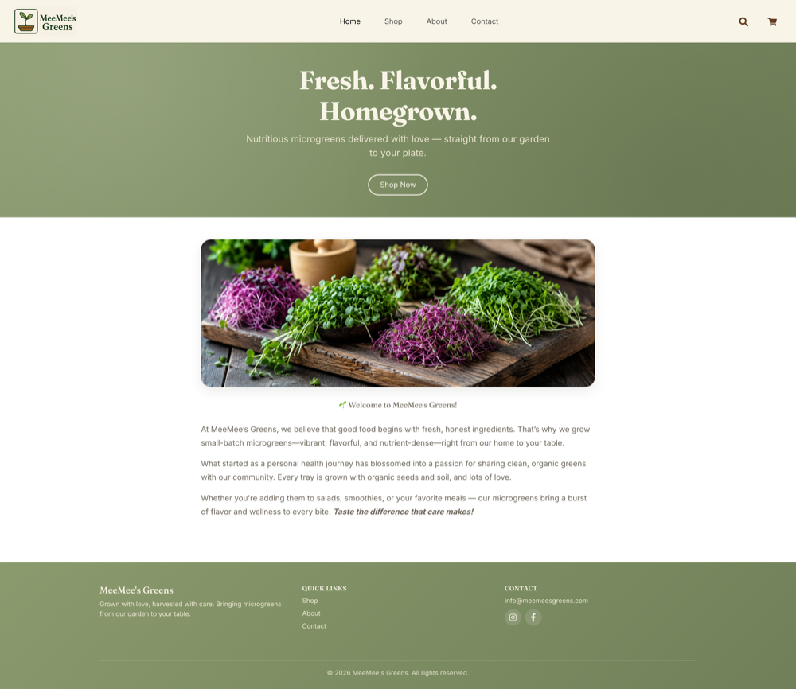

# MeeMee’s Greens - Microgreens Shop

MeeMee’s Greens is a React-based e-commerce web application for selling fresh, locally grown microgreens. The app offers a clean, responsive, and user-friendly interface for customers to browse, add to cart, and place orders for a variety of nutritious microgreens. Product data is served from a Node/Express API backed by a SQLite database.



**Live site:** [microgreens-shop-eta.vercel.app](https://microgreens-shop-eta.vercel.app/)

---

## Features

- **Product Browsing:** View a catalog of available microgreens with images, descriptions, and pricing, fetched live from a backend API and database.
- **Shopping Cart:** Add, update quantities, and remove items from the cart.
- **Checkout Process:** Secure and simple checkout form capturing customer name, email, and delivery address.
- **Order Confirmation:** Displays a thank-you message with customer details after placing an order.
- **Responsive Design:** Fully optimized for desktop, tablet, and mobile devices.
- **Navigation:** Intuitive navigation bar with links to Shop, About and Contact pages.
- **Social Media Links:** Connect with MeeMee’s Greens via Instagram and Facebook.
- **Cart Icon:** Accessible cart icon with item count badge visible on all pages.

---

## Technologies Used

**Frontend**
- React.js
- React Router DOM
- Reactstrap (Bootstrap components for React)
- React Icons
- CSS3 and Bootstrap 5
- JavaScript (ES6+)

**Backend**
- Node.js and Express
- SQLite (via `better-sqlite3`)

---

## Getting Started

### Prerequisites

- Node.js (v14+ recommended)
- npm or yarn

### Installation

1. Clone the repository:

   ```bash
   git clone https://github.com/aventurina/microgreens-shop.git
   cd microgreens-shop
   ```

2. Install dependencies:

   ```bash
   npm install
   # or
   yarn install
   ```

3. Start the app (runs both the React dev server and the API server together):

   ```bash
   npm start
   # or
   yarn start
   ```

   To run them separately instead:

   ```bash
   npm run server   # starts the Express API on http://localhost:4001
   npm run client   # starts the React dev server on http://localhost:3000
   ```

4. Open your browser and navigate to `http://localhost:3000`

---

## Backend / API

The Express server in `server/` exposes the product catalog from a local SQLite database (`server/products.db`, auto-created and seeded on first run):

- `GET /api/products` — list all products
- `GET /api/products/:id` — get a single product by id

The React dev server proxies `/api` requests to the backend (see `"proxy"` in `package.json`), so no CORS configuration is needed during development.

---

## Project Structure

```
server/
 ├─ db.js              # SQLite connection, schema, and seed data
 ├─ index.js            # Express app and API routes
public/
 ├─ images/             # Product images served by the backend
src/
 ├─ assets/            # Images, logos, icons
 ├─ components/        # Reusable components (Header, Footer, Modals, etc.)
 ├─ pages/             # Page components (Home, Shop, About, Contact)
 ├─ App.js             # Main app component with routes
 ├─ index.js           # Entry point
```

---


